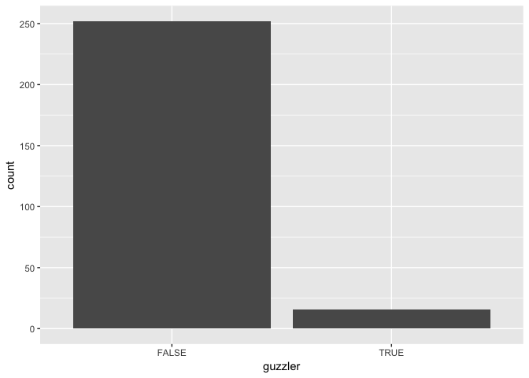
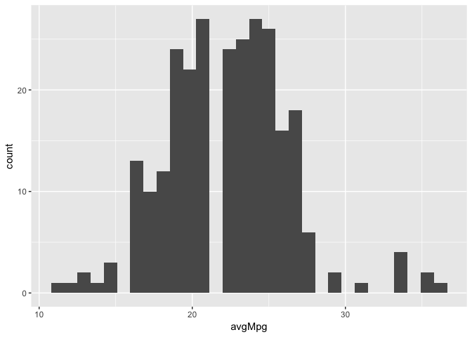
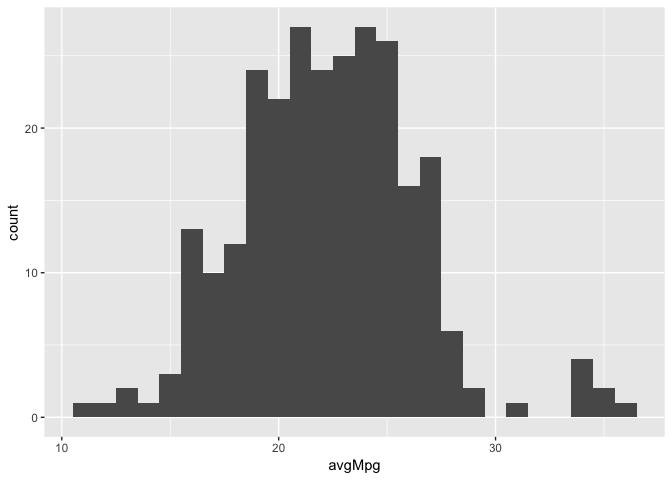
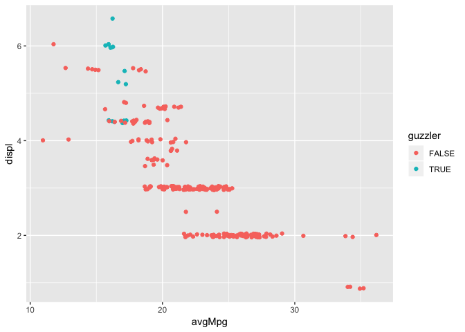

Lab 01 Notebook
================
Christopher Prener, Ph.D.
(September 04, 2018)

## Introduction

This notebook reproduces the code needed for Lab-01.

## Dependencies

This notebook has two dependencies - the data is drawn from the
`testDriveR` package, and it uses functions from the `tidyverse`
including `dplyr` and `ggplot2`.

``` r
# tidyverse packages
library(dplyr)        # tools for data cleaning
```

    ## 
    ## Attaching package: 'dplyr'

    ## The following objects are masked from 'package:stats':
    ## 
    ##     filter, lag

    ## The following objects are masked from 'package:base':
    ## 
    ##     intersect, setdiff, setequal, union

``` r
library(ggplot2)      # tools for plotting

# other packages
library(testDriveR)   # data
```

All of our packages are now ready for use in our lab.

## Load Data

First, we load the data from `testDriveR` into a data frame.

``` r
cars <- auto17
```

We can now call the `cars` object any time we need to access our data.

## Part 1: Cleaning Data

The following pipe of code contains functions for completing questions 1
through 5 - it filters cars produced by German automakers, the selects
the variables needed, then renames the two requested variables, the
creates a new logical variable for low fuel efficiency vehicles, and
re-arranges the dataset based on average fuel efficiency.

``` r
cars %>%
  filter(mfrDivision == "Audi" | mfrDivision == "BMW" | mfrDivision == "Mercedes-Benz" |
           mfrDivision == "Porsche" | mfrDivision == "Volkswagon") %>%
  select(id, mfrDivision, carLine, combFE, guzzlerStr, displ) %>%
  rename(brand = mfrDivision) %>%
  rename(avgMpg = combFE) %>%
  mutate(guzzler = ifelse(guzzlerStr == "G", TRUE, FALSE)) %>%
  arrange(desc(avgMpg)) -> gerCars

head(gerCars)
```

    ##      id         brand                    carLine avgMpg guzzlerStr displ
    ## 1 21232           BMW                       328d     36              2.0
    ## 2 20580 Mercedes-Benz Smart fortwo (Convertible)     35              0.9
    ## 3 21228 Mercedes-Benz       Smart fortwo (Coupe)     35              0.9
    ## 4 21140           BMW                328d xDrive     34              2.0
    ## 5 21141           BMW   328d xDrive Sports Wagon     34              2.0
    ## 6 20583 Mercedes-Benz Smart fortwo (Convertible)     34              0.9
    ##   guzzler
    ## 1   FALSE
    ## 2   FALSE
    ## 3   FALSE
    ## 4   FALSE
    ## 5   FALSE
    ## 6   FALSE

The `head()` function will print the first six observations in our data
set - we see three BMW vehicles and three Mercedes-Benz vehicles.

### 6\. Most Fuel Efficient Car

The most fuel efficient car among German 2017 model year vehicles is the
BMW 328d, which gets 36 miles per gallon on average. Since the data are
sorted (using `arrange()` above), we can determine that the BMW 328d is
the most full efficient because the cars are listed from highest mean
gas mileage to lowest.

### 7\. Total Number of Cars for Sale

There are a number of ways to get this information. You can look up in
your Global Environment tab and note that there are 268 observations in
the `gerCars` data frame. You can also use the following syntax to
reproduce this programmatically:

``` r
nrow(gerCars)
```

    ## [1] 268

### 8\. Gas Guzzlers

We will use the `table()` function to create a simple frequency table:

``` r
table(gerCars$guzzler)
```

    ## 
    ## FALSE  TRUE 
    ##   252    16

16 out of the 268 German cars are considered gas guzzling vehicles by
the U.S. Department of Transportation.

## Part 2: Plotting Data

### 9\. “Guzzler” Bar Plot

The code below creates a `ggplot` object using the `gerCars` data and
then maps an asthetic to the `geom_bar` geom to create the desired plot:

``` r
ggplot(data = gerCars) +
  geom_bar(mapping = aes(guzzler))
```

<!-- -->

This plot highlights the fact that there are very few guzzler vehicles
that are made by German auto manufacturers.

### 10\. Fuel Efficency

The code below creates a `ggplot` object using the `gerCars` data and
then maps an asthetic to the `geom_histogram` geom to create the desired
plot:

``` r
ggplot(data = gerCars) +
  geom_histogram(mapping = aes(avgMpg))
```

    ## `stat_bin()` using `bins = 30`. Pick better value with `binwidth`.

<!-- -->

This plot shows the distribution within the average fuel efficiency
variable. It does not look the best, since there is a large “canyon”
running through the middle of the distribution. This is caused by the
way the `ggplot()` function is “binning” our data - grouping
observations into buckets for plotting purposes. We can adjust the
number of bins with the `bin = val` option, as below:

``` r
ggplot(data = gerCars) +
  geom_histogram(mapping = aes(avgMpg), bins = 26)
```

<!-- -->

Try playing with the number of bins when you make different scatter
plots, and get a feel for how you can alter the presentation of an
underlying distribution.

### 11\. Fuel Effiency and Engine Size

Finally, the code below creates a `ggplot` object using the `gerCars`
data and then maps an asthetic to the `geom_point` geom to create the
desired plot:

``` r
ggplot(data = gerCars) +
  geom_point(mapping = aes(x = avgMpg, y = displ, color = guzzler), position = "jitter")
```

<!-- -->

This plot shows the relationship with engine size and fuel efficiency.
As engine size decreases, fuel efficiency decreases. The gas guzzler
vehicles are concentrate in the high displacement area of the plot, but
interestingly, several vehicles with worse fuel efficiency are *not*
identified as gas guzzlers by the U.S. Department of Transportation.
