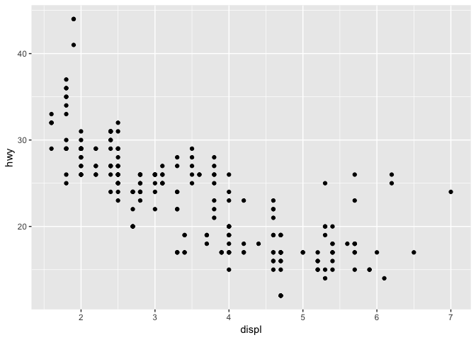
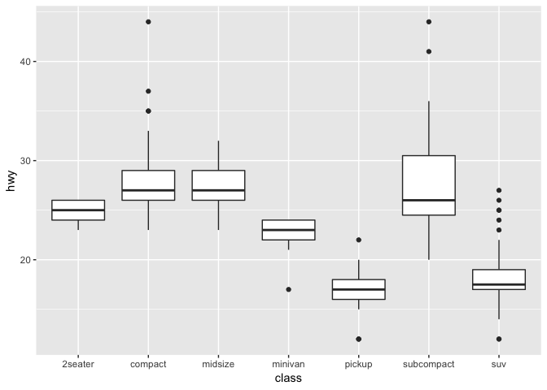

Lecture-02a Notebook
================
Christopher Prener, Ph.D.
(September 05, 2018)

## Introduction

This notebook contains sample code for Lecture-02a - Introducing
`ggplot2`

## Dependencies

This notebook requires only one package - `ggplot2`.

``` r
# tidyverse packages
library(ggplot2)     # plotting data
```

## Load Data

We actually aren’t going to load any data for these examples. The `mpg`
data is automatically loaded into `R`’s memory (but not your
environment) when we load the `ggplot2` package. We can refer to it
directly, as we can all data pre-loaded in packages, without ever
creating an object in our environment.

## Plots

### Histogram

These are good for plotting *continuous* variables.

``` r
ggplot(data = mpg) +
  geom_histogram(mapping = aes(hwy))
```

    ## `stat_bin()` using `bins = 30`. Pick better value with `binwidth`.

<!-- -->

### Line Plots

These are good for plotting *continuous* variables and can be extended
to plot change over time. You should get something similar to a
histogram. The one downside to these plots is that they can be easily
misinterpreted as plotting change over time when they do not do so.

``` r
ggplot(data = mpg) +
  geom_freqpoly(mapping = aes(hwy))
```

    ## `stat_bin()` using `bins = 30`. Pick better value with `binwidth`.

<!-- -->

### Bar Plots

These are good for plotting *binary*, *categorical*, or *ordinal*
variables.

``` r
ggplot(data = mpg) +
  geom_bar(mapping = aes(class))
```

<!-- -->

### Scatter Plots

These are good for comparing two *continuous* variables. You can also
compare a continuous and a binary or categorical measure, but there are
better plots to do that with.

``` r
ggplot(data = mpg) +
  geom_point(mapping = aes(x = displ, y = hwy))
```

<!-- -->

### Scatter Plots

These are good for comparing two *continuous* variables. This is similar
to a scatter plot but it summarizes the general trend. They are best
used together to illustrate both the underlying points *and* the trend.

``` r
ggplot(data = mpg) +
  geom_smooth(mapping = aes(x = displ, y = hwy))
```

    ## `geom_smooth()` using method = 'loess' and formula 'y ~ x'

<!-- -->

### Box Plots

These are good for comparing a *continuous* variable with a *binary*,
*categorical*, or *ordinal* measure.

``` r
ggplot(data = mpg) +
  geom_boxplot(mapping = aes(x = class, y = hwy))
```

<!-- -->
