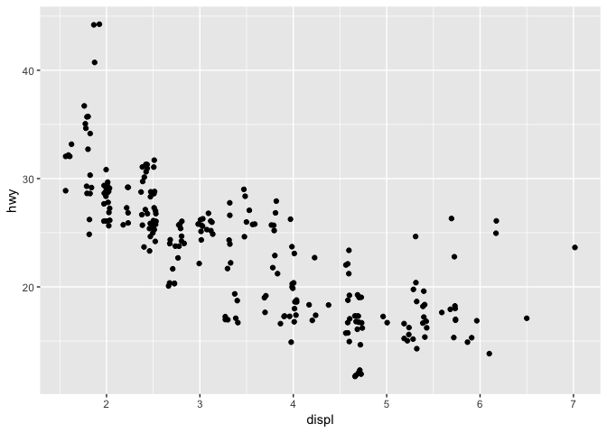

Lecture-02b Notebook
================
Christopher Prener, Ph.D.
(September 05, 2018)

## Introduction

This notebook contains sample code for Lecture-02a - Grammar of Graphics

## Dependencies

This notebook requires only one package - `ggplot2`.

``` r
# tidyverse packages
library(ggplot2)     # plotting data
```

## Load Data

We actually aren’t going to load any data for these examples. The `mpg`
data is automatically loaded into `R`’s memory (but not your
environment) when we load the `ggplot2` package. We can refer to it
directly, as we can all data pre-loaded in packages, without ever
creating an object in our environment.

## Statistical Transformations

What is important to remember and understand about plots is that they
are premised on a principled statistical transformation of some raw,
underlying data.

### Area Plot

These are good for plotting *continuous* variables.

``` r
ggplot(data = mpg) +
  geom_area(mapping = aes(hwy), stat = "bin")
```

    ## `stat_bin()` using `bins = 30`. Pick better value with `binwidth`.

<!-- -->

Remember that `stat = "bin"` *must* be included\!

### The Statistical Transformations Behind Box Plots

Behind the scenes, `ggplot2` is calculating these summary statistics of
the data:

``` r
ggplot(data = mpg) +
  stat_summary(
    mapping = aes(x = class, y = hwy),
    fun.ymin = min,
    fun.ymax = max,
    fun.y = median
  )
```

<!-- -->

When combined with additional graphic information, we can render the box
plot:

``` r
ggplot(data = mpg) +
  geom_boxplot(mapping = aes(x = class, y = hwy))
```

<!-- -->

## Asthetic Adjustments

Aesthetic adjustments allow us to alter the appearance and design of our
plots.

### Adding Color Arbitraility

We can use the `color` argument with a **quoted** input to arbitrarily
select colors:

``` r
ggplot(data = mpg) +
  geom_point(mapping = aes(x = displ, y = hwy), color = "blue")
```

<!-- -->

Note that this setting of color happens *outside* of the aesthetic.

### Adding Color Within the Aesthetic

We can use the `color` argument with a **quoted input** *inside* of the
aesthetic to let `ggplot2` select a color on its own from its default
palette:

``` r
ggplot(data = mpg) +
  geom_point(mapping = aes(x = displ, y = hwy, color = "class"))
```

<!-- -->

Note that the input *must* be quoted in this scenario. If it is not
quoted, we get a very different looking plot:

``` r
ggplot(data = mpg) +
  geom_point(mapping = aes(x = displ, y = hwy, color = class))
```

<!-- -->

That small change - removing the double quotes - now allows `ggplot2` to
color the points by vehicle class. This allows us to identify subtle
patterns in the data easily.

This same approach works with other geoms as well, though we have to
change the `color` argument to `fill`:

``` r
ggplot(data = mpg) +
  geom_bar(mapping = aes(x = class, fill = class))
```

<!-- -->

If we use a different variable for `fill` than what is specified for
`x`, we can produced a “stacked” bar plot:

``` r
ggplot(data = mpg) +
  geom_bar(mapping = aes(x = class, fill = trans))
```

<!-- -->

### Position Adjustments

In addition to creating stacked plots, we can also dis-aggregate our
data so that we get a series of bars for each `fill` category within a
given `x` category. This is done with the `position = "dodge"` argument:

``` r
ggplot(data = mpg) +
  geom_bar(mapping = aes(x = class, fill = trans), position = "dodge")
```

<!-- -->

This helps us see that an overwhelming number of cars that are SUVs have
two particular types of transmissions, for example.

We can also use a different type of position adjustment to reveal
“missing” points on a scatter plot. A normal scatter plot stacks
identical combinations of x,y pairs in a way that makes the data appear
less numerous than they actually are. For example:

``` r
ggplot(data = mpg) +
  geom_point(mapping = aes(x = displ, y = hwy))
```

<!-- -->

The `"jitter"` argument for `position` adds some random noise to each
point, ensuring that identical points do not perfectly overlap and we
get a better (if messier) understanding of where the bulk of our
observations lie:

``` r
ggplot(data = mpg) +
  geom_point(mapping = aes(x = displ, y = hwy), position = "jitter")
```

<!-- -->

## Flipping Coordinates

We can use the `coord_flip()` argument to adjust the position of bar
plots so that they are horizontal:

``` r
ggplot(data = mpg) +
  geom_bar(mapping = aes(x = class, fill = trans), position = "dodge") +
  coord_flip()
```

<!-- -->
