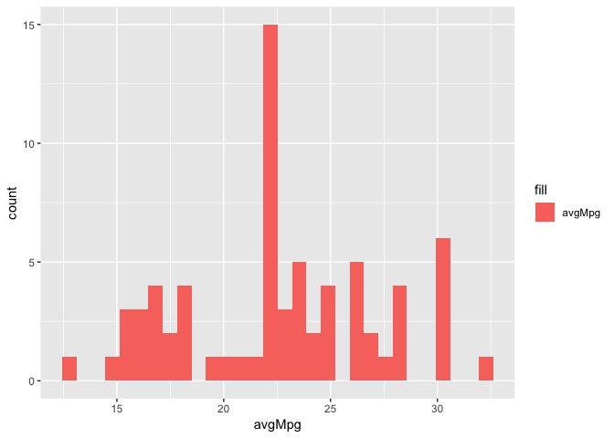

Lecture-02b Notebook
================
Christopher Prener, Ph.D.
(September 06, 2018)

## Introduction

This notebook contains sample code for Lecture-02c - Verbs for Cleaning
Data.

## Dependencies

This notebook requires two packages - `ggplot2` and `dplyr`.

``` r
# tidyverse packages
library(dplyr)       # cleaning data
```

    ## 
    ## Attaching package: 'dplyr'

    ## The following objects are masked from 'package:stats':
    ## 
    ##     filter, lag

    ## The following objects are masked from 'package:base':
    ## 
    ##     intersect, setdiff, setequal, union

``` r
library(ggplot2)     # plotting data
```

## Load Data

For this set of examples, we’ll take the `mpg` data from the `ggplot2`
package and assign it to a new object to work with:

``` r
autoData <- mpg
```

For the rest of the code, we’ll reference `autoData` as a starting
point.

## Cleaning Data

### Renaming Variables

Output from the `dplyr` functions always needs to be assigned to an
object. You can either choose to create that new object:

``` r
carsData <- rename(autoData, hwyMpg = hwy)
```

or choose the preserve an existing object:

``` r
vehicleData <- rename(autoData, hwyMpg = hwy)
```

In both cases, the new variable name is specified and set equal to the
old variable name.

### Ordering Data

If you want to reorder the observations, you can use arrange to do so.
The `autoData` data are in the following order:

``` r
head(autoData)
```

    ## # A tibble: 6 x 11
    ##   manufacturer model displ  year   cyl trans drv     cty   hwy fl    class
    ##   <chr>        <chr> <dbl> <int> <int> <chr> <chr> <int> <int> <chr> <chr>
    ## 1 audi         a4      1.8  1999     4 auto… f        18    29 p     comp…
    ## 2 audi         a4      1.8  1999     4 manu… f        21    29 p     comp…
    ## 3 audi         a4      2    2008     4 manu… f        20    31 p     comp…
    ## 4 audi         a4      2    2008     4 auto… f        21    30 p     comp…
    ## 5 audi         a4      2.8  1999     6 auto… f        16    26 p     comp…
    ## 6 audi         a4      2.8  1999     6 manu… f        18    26 p     comp…

They are alphabetical. We can use `arrange()` to reorder them in
*ascending*:

``` r
autoData <- arrange(autoData, cty)
head(autoData)
```

    ## # A tibble: 6 x 11
    ##   manufacturer model displ  year   cyl trans drv     cty   hwy fl    class
    ##   <chr>        <chr> <dbl> <int> <int> <chr> <chr> <int> <int> <chr> <chr>
    ## 1 dodge        dako…   4.7  2008     8 auto… 4         9    12 e     pick…
    ## 2 dodge        dura…   4.7  2008     8 auto… 4         9    12 e     suv  
    ## 3 dodge        ram …   4.7  2008     8 auto… 4         9    12 e     pick…
    ## 4 dodge        ram …   4.7  2008     8 manu… 4         9    12 e     pick…
    ## 5 jeep         gran…   4.7  2008     8 auto… 4         9    12 e     suv  
    ## 6 chevrolet    c150…   5.3  2008     8 auto… r        11    15 e     suv

Now we can see that the lowest city mileage vehicles are the first
observations (look for the `cty` column above).

If we want to put these in *descending* order, so that the highest city
mileage vehicles are the first observations, we can wrap the `desc()`
function inside `arrange()`:

``` r
autoData <- arrange(autoData, desc(cty))
head(autoData)
```

    ## # A tibble: 6 x 11
    ##   manufacturer model displ  year   cyl trans drv     cty   hwy fl    class
    ##   <chr>        <chr> <dbl> <int> <int> <chr> <chr> <int> <int> <chr> <chr>
    ## 1 volkswagen   new …   1.9  1999     4 manu… f        35    44 d     subc…
    ## 2 volkswagen   jetta   1.9  1999     4 manu… f        33    44 d     comp…
    ## 3 volkswagen   new …   1.9  1999     4 auto… f        29    41 d     subc…
    ## 4 honda        civic   1.6  1999     4 manu… f        28    33 r     subc…
    ## 5 toyota       coro…   1.8  2008     4 manu… f        28    37 r     comp…
    ## 6 honda        civic   1.8  2008     4 manu… f        26    34 r     subc…

Note that we’re adding complexity, as we did the first day, by *nesting*
functions - one within another.

### Subsetting Data

One way to subset data is by pulling out the observations (or rows) you
are interested in for further analysis. This is the number of rows in
the current data set:

``` r
nrow(autoData)
```

    ## [1] 234

We can subset based on any characteristic in the data. For example, we
could pull out only the high mileage vehicles:

``` r
himpg <- filter(autoData, hwy >= 30)
nrow(himpg)
```

    ## [1] 26

We use the relational operator `>=` (“greater than or equal to”) to pull
out all of the vehicles with highway miles per gallon values that are 30
or more. There are 26 of them.

We can also subset based on string data. For example, we could pull out
only Subaru models:

``` r
subaru <- filter(autoData, manufacturer == "subaru")
nrow(subaru)
```

    ## [1] 14

We use the relational operator `==` (“exactly equal to”) to select
observations based on string data. There are 14 Subaru vehicles in our
data.

Finally, we can subset by variables rather than by observations. We’ll
use `select()` to do this. This gives us a data frame that is not as
wide - it only has the columns we desire. Here, we’ll keep only the
variables related to the branding of the vehicle:

``` r
brands <- select(autoData, manufacturer, model, year)
head(brands)
```

    ## # A tibble: 6 x 3
    ##   manufacturer model       year
    ##   <chr>        <chr>      <int>
    ## 1 volkswagen   new beetle  1999
    ## 2 volkswagen   jetta       1999
    ## 3 volkswagen   new beetle  1999
    ## 4 honda        civic       1999
    ## 5 toyota       corolla     2008
    ## 6 honda        civic       2008

We also also remove columns using a slight modification to our syntax.
We’ll remove the columns related to engine size:

``` r
noEngine <- select(autoData, -displ, -cyl, -trans, -drv)
head(noEngine)
```

    ## # A tibble: 6 x 7
    ##   manufacturer model       year   cty   hwy fl    class     
    ##   <chr>        <chr>      <int> <int> <int> <chr> <chr>     
    ## 1 volkswagen   new beetle  1999    35    44 d     subcompact
    ## 2 volkswagen   jetta       1999    33    44 d     compact   
    ## 3 volkswagen   new beetle  1999    29    41 d     subcompact
    ## 4 honda        civic       1999    28    33 r     subcompact
    ## 5 toyota       corolla     2008    28    37 r     compact   
    ## 6 honda        civic       2008    26    34 r     subcompact

### New Variables

The `mutate()` verb is used to create new variables. Here we’ll create a
variable that represents the mean of the `cty` and `hwy` miles per
gallon measures:

``` r
autoData <- mutate(autoData, avgMpg = (cty+hwy)/2)
```

We use parentheses to enforce order of operations, and the mathematical
operators like `/` (division) and `+` (addition).

We can create new binary variables by wrapping the `ifelse()` function
inside your `mutate()` function:

``` r
autoData <- mutate(autoData, hiMpg = ifelse(hwy >= 30, TRUE, FALSE))
```

Each observation of `hwy` is evaluated based on whether or not it is
`>= 30`. If it is, `TRUE` is put in for the value of the new variable
`hiMpg`. If it is not, `FALSE` is put in for the new value of the
variable.

This works for strings,
too:

``` r
autoData <- mutate(autoData, subaruBin = ifelse(manufacturer == "subaru", TRUE, FALSE))
```

### The Pipe Operator

We can use “pipes” and the pipe operator (`%>%`) to string tidyverse
functions together:

``` r
autoData %>%
  select(manufacturer, model, cty, hwy) %>%
  rename(cityMpg = cty) %>%
  rename(hwyMpg = hwy) %>%
  filter(manufacturer == "honda" | 
           manufacturer == "nissan" | 
           manufacturer == "subaru" |
           manufacturer == "toyota") %>%
  mutate(avgMpg = (cityMpg+hwyMpg)/2) %>%
  arrange(avgMpg) -> japaneseAutos
```

Notice how the assignment operator appears at the end and is right
facing - this is my preferred way of crafting pipelines (though it is
not the only way to achieve the same end, which is the creation of a new
object named `japaneseAutos` that has the specified characteristics).
Notice how the `filter()` function uses the logical operator `|` (“or”)
to make multiple selections of manufacturers.

We can also pipe into `ggplot` calls:

``` r
autoData %>%
  select(manufacturer, model, cty, hwy) %>%
  rename(cityMpg = cty) %>%
  rename(hwyMpg = hwy) %>%
  filter(manufacturer == "honda" | 
           manufacturer == "nissan" | 
           manufacturer == "subaru" |
           manufacturer == "toyota") %>%
  mutate(avgMpg = (cityMpg+hwyMpg)/2) %>%
  arrange(avgMpg) %>%
  ggplot() +
    geom_histogram(mapping = aes(avgMpg, fill = "avgMpg"))
```

    ## `stat_bin()` using `bins = 30`. Pick better value with `binwidth`.

<!-- -->

Pipes make our code more readable, and should be used based on the
guidelines in the slides\!
